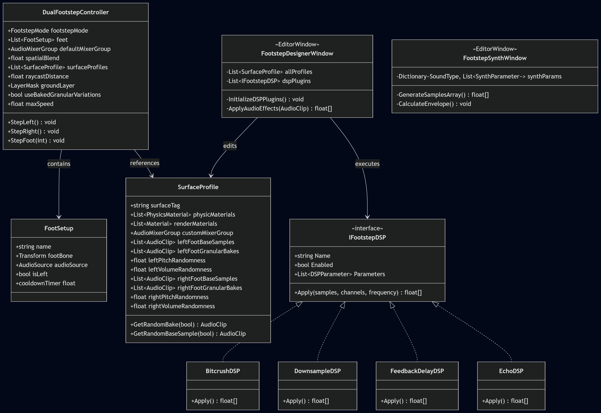

# FootstepDesigner

A modular footstep audio design tool for Unity. Intended (but not limited) for VR developers. Runs on low-spec hardware, making it compatible with all machines.

Dissertation project by Jaden Adamczak, TCD PG AR/VR, 2026.

## What it does

Gives developers a node-based editor to map, configure, and tweak footstep sounds per material. Handles per-foot surface detection, material transitions, pitch/volume control, and ships with a free default sound library.

## Stack

- Unity (2022 LTS or later)
- C# (editor + runtime)
- Any VR Headset (optimized for standalone/mobile VR)

## Technical novelty: AMPSS

This tool implements what we decided to call **Asymmetric Multi-Pedal Sound Synthesis (AMPSS)**. 

Unlike traditional systems that cycle random footstep sounds symmetrically, AMPSS processes each foot bone classification independently (e.g. tracking a boot and a peg-leg separately). It maps runtime velocity directly to pitch variance, volume, and variation selection. 

By pre-baking granular synthesis variations offline, AMPSS delivers dynamic locomotion-audio scaling at runtime with zero CPU overhead, making it ideal for standalone VR and mobile hardware.

## Folder structure

```
FootstepDesigner/
  Editor/               # Editor-only code (node graph, inspectors, import tools)
  Runtime/              # Runtime code (footstep controller, detectors, FMOD bridge)
    Detection/          # Foot detection strategies (raycast, bone-based)
    Audio/              # FMOD wrapper, sound bank playback
    Data/               # ScriptableObject definitions
  Resources/            # Default config assets
  Samples~/             # Default sound library (H4 recordings)
  Documentation~/       # Architecture docs, class diagram
```

## Architecture, updated 07/07/2026



## License

This project is licensed under the MIT License. See [LICENSE](file:///c:/DEV/Trinity/Dissertation/FootstepDesigner/LICENSE) for details.

